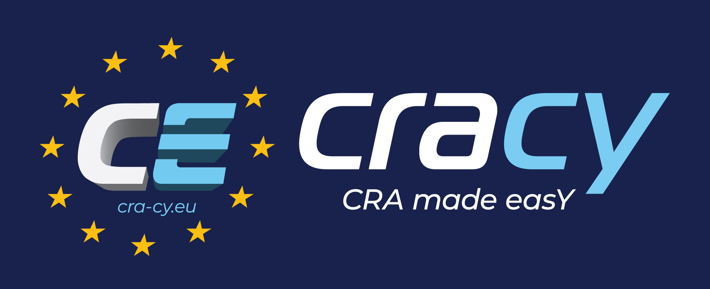

[![Contributors][contributors-shield]][contributors-url]
[![Forks][forks-shield]][forks-url]
[![Stargazers][stars-shield]][stars-url]
[![Issues][issues-shield]][issues-url]
[![LinkedIn][linkedin-shield]][linkedin-url]
[![project_license][license-shield]][license-url]

 

<h3 align="center">Secure software updates</h3>
  

    <strong>CRA-compliant software update procedures using The Update Framework</strong>
     
    <a href="https://github.com/excid-io/cra-tuf-training//issues/new?labels=bug&template=bug-report---.md">Report Bug</a>
    &middot;
    <a href="https://github.com/excid-io/cra-tuf-training//issues/new?labels=enhancement&template=feature-request---.md">Request Feature</a>
  

## 🛡️ Training Overview: Secure Software Updates

This training introduces the fundamental concepts behind **secure software updates** and explains why they are a critical component of a **secure software supply chain**.

We begin by exploring the requirements introduced by the **🇪🇺 Cyber Resilience Act (CRA)**, highlighting the obligations placed on manufacturers to ensure that **Products with Digital Elements (PDEs)** receive secure and timely security updates throughout their lifecycle.

Next, we examine the **architecture and threat model** of software update systems. We show that update infrastructures face a wide range of sophisticated attacks—such as rollback attacks, freeze attacks, and repository compromises—demonstrating why update mechanisms cannot be secured in a trivial way.

Building on this context, the training introduces **The Update Framework**, explaining how it protects update systems through:
- clearly defined **roles and trust relationships** 🔑  
- **signed metadata** describing the state of the repository 📜  
- **delegations** that distribute trust and limit the impact of key compromise  
- **consistent snapshots** that ensure clients observe a coherent view of the repository 📦  

Finally, we review the **client update workflow**, illustrating how clients securely retrieve metadata, verify signatures, detect attacks, and safely download and install software updates.

✨ Together, these concepts provide a practical foundation for **designing and implementing secure software update mechanisms** that can withstand real-world **software supply chain threats** and support compliance with modern cybersecurity regulations.

## Modules
### 📘 Module 1 – Introduction
This module sets the foundation for the training by presenting **secure software updates** as a core obligation under the **Cyber Resilience Act**. It introduces the regulatory requirements that **Products with Digital Elements** must meet in terms of update security, integrity, authenticity, and lifecycle resilience. The module also presents a **reference software update architecture** and discusses the **main threats** that modern update systems must defend against.

🔗 **[Go to Module 1 →](module-1/README.md)**

---

### 🔐 Module 2 – The Update Framework
This module introduces **The Update Framework**, a security framework designed to protect software update systems against advanced adversaries. It explains the main concepts of the framework, including its **roles, metadata, trust model, and security mechanisms**, and shows how it helps build update infrastructures that are resilient to compromise.

🔗 **[Go to Module 2 →](module-2/README.md)**

---

### 🛠️ Module 3 – Hands-on
In this module, participants apply the concepts learned in the previous modules through a **hands-on exercise**. We use **TUF-on-CI**, a repository and signing tool based on The Update Framework, to demonstrate how a secure update repository can be created and managed in practice.

🔗 **[Go to Module 3 →](module-3/README.md)**

## License

Distributed under the CC-BY-SA-4.0 License. See `LICENSE.TXT` for more information.

<!-- CONTACT -->
## Contact

The CRACY project info@cra-cy.eu

Project Link: [https://github.com/excid-io/cra-tuf-training/tree/main](https://github.com/excid-io/cra-tuf-training/tree/main)

<!-- ACKNOWLEDGMENTS -->
## Acknowledgments

* [Initial contribution by ExcID](https://excid.io)
---

[contributors-shield]: https://img.shields.io/github/contributors/excid-io/cra-tuf-training.svg?style=for-the-badge
[contributors-url]: https://github.com/excid-io/cra-tuf-training/graphs/contributors
[forks-shield]: https://img.shields.io/github/forks/excid-io/cra-tuf-training.svg?style=for-the-badge
[forks-url]: https://github.com/excid-io/cra-tuf-training/network/members
[stars-shield]: https://img.shields.io/github/stars/excid-io/cra-tuf-training.svg?style=for-the-badge
[stars-url]: https://github.com/excid-io/cra-tuf-training/stargazers
[issues-shield]: https://img.shields.io/github/issues/excid-io/cra-tuf-training.svg?style=for-the-badge
[issues-url]: https://github.com/excid-io/cra-tuf-training/issues
[license-shield]: https://img.shields.io/badge/CC--BY--SA--4.0-lightgrey?style=for-the-badge
[license-url]: https://github.com/excid-io/cra-tuf-training/blob/main/LICENCSE.txt
[linkedin-shield]: https://img.shields.io/badge/-LinkedIn-black.svg?style=for-the-badge&logo=linkedin&colorB=555
[linkedin-url]: https://www.linkedin.com/company/cracy/
