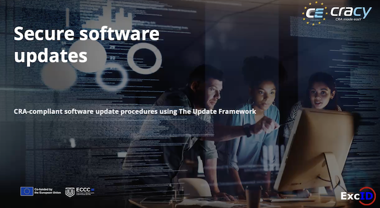

# 🔐 Module 2 – The Update Framework

## Overview
Module 2 introduces **The Update Framework**, a security framework designed to protect software update systems against advanced adversaries.

The module explains the core concepts of The Update Framework, including its **trust model, roles, and signed metadata**, and how these elements work together to provide strong security guarantees for software update infrastructures. It also discusses mechanisms such as **delegations**, **consistent snapshots**, and the **secure client update workflow**, which enable update systems to remain secure even when parts of the infrastructure are compromised.

By the end of this module, you will understand how The Update Framework helps build **compromise-resilient software update systems** capable of defending against common supply chain attacks.

---

## 🎥 Module Video

Watch the full lecture below:

---

## 📚 Learning Objectives

After completing this module, you will be able to:

- Understand the **purpose and security goals of The Update Framework**
- Describe the **roles and metadata structure** used by the framework
- Explain the concept of **delegations and distributed trust**
- Understand **consistent snapshots** and why they are needed
- Describe the **secure client update workflow**

---

## 🔗 Next Module

➡️ Continue with the next module to apply the concepts in practice using a real implementation.

 **[Go to Module 3 →](../module-3/README.md)**